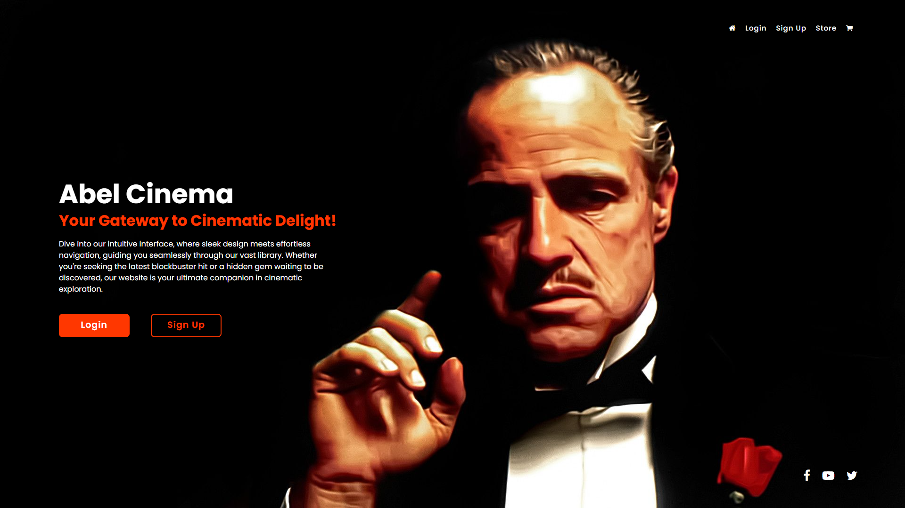
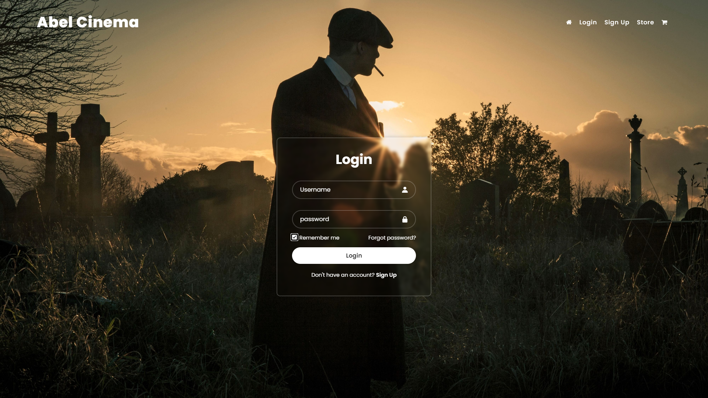
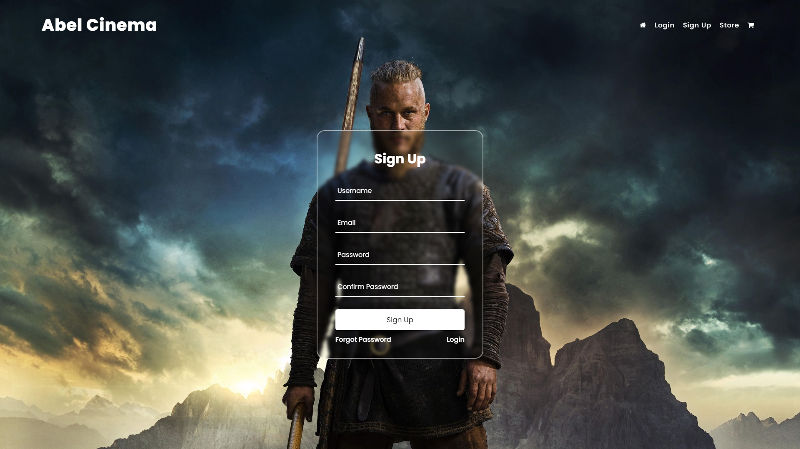
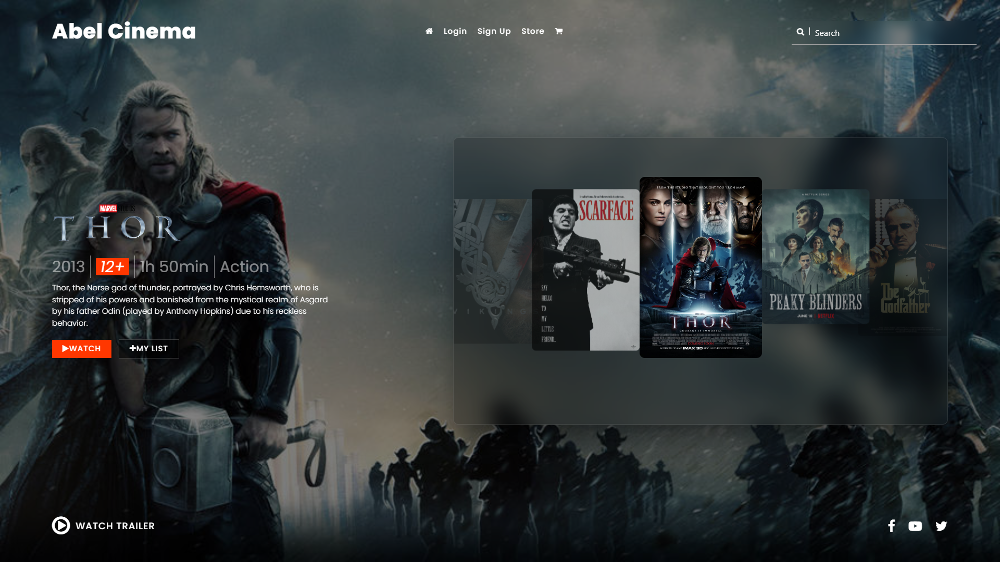
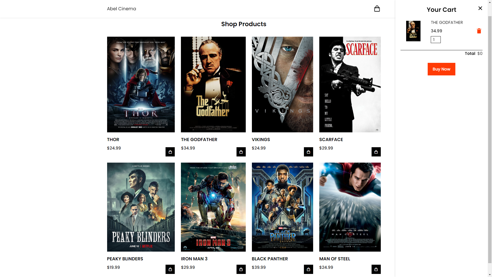

# ABEL CINEMA | Your gateway to Cinematic Delight!
## Home Page
From the moment visitors land on my site, they're greeted with a visually stunning interface (TheGodFather) that beckons them to explore further.

## Login
My login sets the gold standard for user-friendly access to cinematic content. Seamlessly blending security with simplicity, it offers a hassle-free login experience that prioritize both convenience and privacy.

## Sign-Up
The sign-up page boasts an intuitive interface, guiding users effortlessly through the registration steps. Clear instructions and minimal form field ensure a quick and straightforward sign-up experience, reducing friction and encouraging users to dive into the world of movies without delay.

## Store
My carousel store is designed for maximum engagement. It's not just a static display of images, it's a dynamic focal point that captures users' attention and invites them to immerse themselves in the cinematic experience. Whether users are seeking out new releases, classic favorites, or hidden gems, my store serves as a gateway to endless entertainment possibilities.

## Cart
My cart/checkout is a seamless and efficient platform that makes renting or purchasing movies a breeze. With a user-friendly interface and intuitive design, it guides users through the checkout process with ease.
